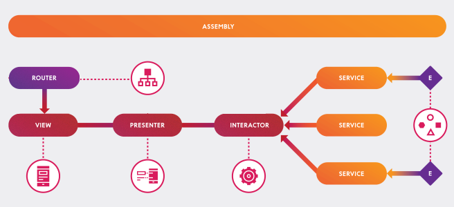

# Times Test 

In the following lines I will try to detail a little the approach that I have followed to carry out the test.

**NOTE**: This is a CocoaPods based project. You must have installed CocoaPods on your Mac and execute `pod install` over the currrent directory. Once do this, dont forget open the application via `Times.workspace` file. 😉

## Architecture

For the implementation of this application I have chosen to implement the architecture based on the VIPER pattern (View, Interactor, Presenter, Entity, Routing). The following diagram illustrates a little each layers and how are communicated between them.

In this implementation of  VIPER architecture. Really has a more purist definition, the routing layer is placed in direct contact with the presenter. 

In my interpretation, I place it at the level of the View layer, in direct interaction with the viewcontroller. I do this to maintain the responsibility of the navigation within the View layer.

For the REST client I use the Alamofire library, basically for convenience and simplicity. 

## Api implementation

I have used the new implementation of the most popular API. https://developer.nytimes.com/docs/most-popular-product/1/overview 

I have detected that this version of the API does not include the Twitter option for more shared aricles. If the twitter option is selected the API returns an error.

## View construction

The creation and construction of views is done programmatically, in a more declarative and readable way. I do in this way, because in my experience, most of the time when building very complex or elaborate views, the power provided by a Xib or a StoryBoard is limited.
